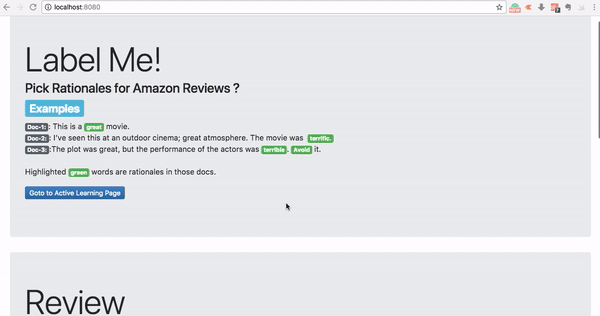

# CD

CD aims to create a dataset which is suited for Active Learning with Rationale using simple Web UI, so in this project, I did learning with rationale using Human generated labeler(chi-square), but not satisfied(personally) it is just based on pure statistics. Even If we tweak all the way around it can’t be as good as a human since complex inference in risk domain such as Medical, Self-Driving cars are still taken by Humans. So I developed an App to Create Datasets which is a by-product of My CS595-01 Class Project – “Sentimental analysis on Amazon Review”.

Creating a Training Datasets is not an easy process, so I thought I will open-source UI which I used for myself to Label rationales on Amazon Review Dataset on Musical Instruments. This app is written in Python and HTML, so it is very easy to extend adapt to LwE models. 

Check the [report.pdf](Report.pdf)

[Main-Notebook](notebook/IML-Project-Final.ipynb)

## Run Web App for Labelling
`python CD.py`

It will be Running on http://0.0.0.0:1527/  

If you want to load your own database, check the notebook[Data Load Notebook](data-load-mongodb.ipynb) on how to load the database to local MongoDB. 

## Other Docs
- Please find the report.pdf for more.
- [Web Demo](demo.mov)
